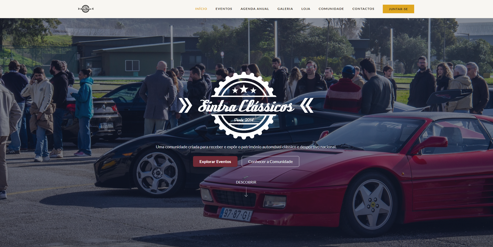

<div align="center">

# 🚗 Sintra Clássicos

### Encontros & Eventos

*A comunidade que celebra o património automóvel clássico na região mais romântica de Portugal*

[](https://developer.mozilla.org/pt-PT/docs/Web/HTML)
[](https://developer.mozilla.org/pt-PT/docs/Web/CSS)
[](https://developer.mozilla.org/pt-PT/docs/Web/JavaScript)
[](https://getbootstrap.com/)



</div>


---

## 📋 Sobre o Projeto

**Sintra Clássicos** é um website académico desenvolvido para uma comunidade de entusiastas de carros clássicos na zona de Sintra, Portugal. O projeto visa criar uma plataforma digital que promova encontros, divulgue eventos, partilhe informação e fortaleça a cultura automóvel clássica local.

O site oferece uma experiência visual elegante inspirada no património automóvel clássico, com uma paleta de cores vintage que reflete a sofisticação e tradição dos automóveis clássicos.

### ✨ Características Principais

- 🎨 **Design Vintage** - Paleta de cores inspirada em automóveis clássicos
- 📱 **Totalmente Responsivo** - Adapta-se perfeitamente a todos os dispositivos
- ⚡ **Performance Otimizada** - Carregamento rápido (bibliotecas servidas via CDN); não requer servidor para abrir, exceto para gerar a configuração do mapa quando necessário
- ♿ **Acessível** - Estrutura semântica e navegação por teclado
- 🎯 **Fácil de Usar** - Interface intuitiva e navegação clara

---

## 🎯 Objetivos

| Objetivo | Descrição |
|----------|-----------|
| **📢 Divulgação** | Criar um espaço centralizado para divulgação de encontros e eventos relacionados com carros clássicos na região de Sintra |
| **👥 Comunidade** | Facilitar a interação e participação de entusiastas na comunidade |
| **ℹ️ Informação** | Partilhar informações relevantes sobre eventos, agenda anual e atividades |
| **🤝 Envolvimento** | Promover a participação através de formulários de contacto, pré-inscrições e candidaturas |

---

## 🛠️ Tecnologias Utilizadas

<div align="center">

| Tecnologia | Versão | Descrição |
|------------|--------|-----------|
| **HTML5** | 5.0 | Estrutura semântica e acessível |
| **CSS3** | 3.0 | Estilização customizada com variáveis CSS |
| **JavaScript** | ES6+ | Funcionalidades interativas |
| **Bootstrap** | 5.3.3 | Framework CSS para layout responsivo |
| **Google Fonts** | - | Tipografias Lato e Playfair Display |
| **Font Awesome** | 6.x | Ícones para redes sociais e UI |
| **Google Maps API + MarkerClusterer** | - | Mapa interativo e clusterização de marcadores (opcional; requer API key) |

</div>

---

## 📁 Estrutura do Projeto

```
Sintraclassicos/
│
├── 📄 index.html          # Página principal (todo o conteúdo HTML)
├── 📜 main.js             # Lógica JavaScript principal
├── 📜 mapa.js             # Lógica do mapa interativo
├── 📜 cms-loader.js       # Carrega conteúdo dinamicamente do CMS
├── 🎨 style.css           # Estilos customizados
├── 📄 package.json        # Dependências e scripts
├── 📄 netlify.toml        # Configuração do Netlify
│
├── 📁 admin/              # Interface do CMS
│   ├── index.html         # Interface do CMS
│   └── config.yml         # Configuração do CMS
├── 📁 static/admin/       # Configuração do CMS (produção)
│   └── config.yml
├── 📁 content/            # Conteúdo editável via CMS
│   ├── hero/
│   ├── eventos/
│   ├── agenda/
│   ├── galeria/
│   ├── loja/
│   ├── comunidade/
│   ├── contactos/
│   └── config/
├── 📁 scripts/            # Scripts de build
│   └── generate-config.js # Gera config.js a partir de .env
└── 📁 img/                # Imagens
    ├── 🖼️ banner.jpg      # Banner principal
    └── 🖼️ logo.jpg         # Logótipo
```

---

## ✨ Funcionalidades

### 🧭 Navegação

- ✅ Menu de navegação fixo com scroll suave
- ✅ ScrollSpy para destacar secção ativa
- ✅ Design responsivo com menu hambúrguer para dispositivos móveis
- ✅ Links de navegação rápida no footer

### 📑 Secções Principais

1. **🏠 Hero** - Apresentação da comunidade com call-to-action
2. **📅 Próximos Eventos** - Destaque para eventos futuros com botões de participação
3. **📆 Agenda Anual** - Calendário de eventos ao longo do ano
4. **🖼️ Galeria** - Exibição de imagens de carros clássicos e eventos
5. **👥 Comunidade** - Informações sobre a comunidade e formulário de candidatura
6. **📧 Contactos** - Formulário para eventos e parcerias

### 🎮 Interatividade

#### Formulários
- 📬 Newsletter/alerta de eventos (hero) — opcional; o handler JS está preparado se o formulário for adicionado ao HTML
- 📝 Candidatura ao núcleo de organização (comunidade)
- 💼 Contacto para eventos/parcerias

#### Modais
- 💬 Sistema de feedback reutilizável para confirmação de ações
- ✅ Mensagens de sucesso após submissão de formulários

---

## 🎨 Design

### 🎨 Paleta de Cores

O design utiliza uma paleta vintage inspirada em automóveis clássicos:

| Cor | Valor | Uso |
|-----|-------|-----|
| **Primary** | `hsl(350, 45%, 30%)` | Bordô - cor principal |
| **Gold** | `hsl(42, 75%, 50%)` | Dourado - acentos elegantes |
| **Background** | `hsl(40, 30%, 96%)` | Creme claro - fundo principal |
| **Foreground** | `hsl(30, 20%, 15%)` | Castanho escuro - texto principal |

### ✍️ Tipografia

- **Títulos**: `Playfair Display` (serif) - elegante e clássica
- **Corpo**: `Lato` (sans-serif) - legível e moderna

---

## 🚀 Como Executar

### 📋 Pré-requisitos

- **Nenhum** para simplesmente abrir o site (funciona diretamente no navegador).
- **Node.js (opcional)** — necessário para executar scripts como `npm run generate-config` que geram `config.js` a partir de `.env` (utilizado pela Google Maps API).

### 💻 Execução

#### Opção 1: Execução Direta (Recomendado)
1. Abre o ficheiro `index.html` com um duplo clique
2. O site abrirá automaticamente no teu navegador padrão

> **Nota:** Se estiveres a usar o mapa, copia `.env.example` para `.env`, preenche `GOOGLE_API_KEY` e executa `npm run generate-config` antes de abrir a página (ou sempre que alterares a chave).

#### Opção 2: Com Servidor Local

**Visual Studio Code:**
1. Instala a extensão "Live Server"
2. Clica com botão direito em `index.html`
3. Seleciona "Open with Live Server"

---

## 📝 Características Técnicas

### 🏗️ Arquitetura

- ✅ Todo o conteúdo HTML está incluído no `index.html` para funcionar sem servidor
- ✅ Código JavaScript organizado e modular
- ✅ Reutilização de componentes através de estrutura HTML semântica

### 📱 Responsividade

- ✅ Design mobile-first
- ✅ Breakpoints do Bootstrap 5 (xs, sm, md, lg, xl, xxl)
- ✅ Navegação adaptativa para diferentes tamanhos de ecrã
- ✅ Imagens e layouts que se adaptam automaticamente

### ♿ Acessibilidade

- ✅ Estrutura semântica HTML5
- ✅ Navegação por teclado
- ✅ Atributos ARIA onde necessário
- ✅ Contraste adequado de cores (WCAG)

### ⚡ Performance

- ✅ Uso de CDN para Bootstrap e Google Fonts
- ✅ Código JavaScript otimizado
- ✅ Carregamento direto sem dependências externas de ficheiros
- ✅ Imagens otimizadas

---

## 📚 Notas de Desenvolvimento

### 📄 Estrutura HTML

Todo o conteúdo está incluído diretamente no `index.html` para garantir que o site funcione quando aberto diretamente no navegador, sem necessidade de servidor web.

### 📝 Formulários

Os formulários são processados no lado do cliente (demonstração académica). Em produção, seria necessário implementar um backend para processar os dados.

### 🔄 Sistema de Conteúdo Dinâmico

O site carrega conteúdo dinamicamente através do `cms-loader.js`, que lê ficheiros JSON da pasta `content/`. Isto permite:
- Edição de conteúdo via CMS sem alterar código
- Versionamento de conteúdo no Git
- Deploy automático após alterações no CMS

### ⚙️ Scripts Disponíveis

```bash
# Gerar config.js a partir de .env (para Google Maps)
npm run generate-config

# Build completo (gera config.js e atualiza índices)
npm run build

# Atualizar índice da galeria (lista todos os arquivos JSON)
npm run update-galeria-index

# Reorganizar orders da galeria automaticamente (ordena por data e reatribui orders)
npm run reorganize-galeria

# Servidor local simples
npm run serve

# Servidor local na porta 8888
npm run dev

# Netlify Dev (simula ambiente Netlify com CMS)
npm run netlify:dev
```

### 🔧 Configuração do Google Maps

Para usar o mapa interativo:

1. **Desenvolvimento Local:**
   - Copia `.env.example` para `.env`
   - Adiciona a tua `GOOGLE_API_KEY` no ficheiro `.env`
   - Executa `npm run generate-config`

2. **Produção (Netlify):**
   - Vai a **Site settings** → **Environment variables**
   - Adiciona variável `GOOGLE_API_KEY` com o valor da tua chave
   - O build automático gera o `config.js` durante o deploy

> **Nota:** O ficheiro `config.js` está no `.gitignore` para não expor a chave no Git.

### 📝 CMS (Decap CMS)

O site está configurado com **Decap CMS** (anteriormente Netlify CMS) para permitir edição de conteúdo sem alterar código.

#### Como Aceder ao CMS

1. Acede a `https://seu-site.netlify.app/admin`
2. Faz login com a tua conta GitHub (ou Netlify)
3. Começa a editar conteúdo!

#### Secções do CMS

- **Hero Section** - Subtitle e botões
- **Próximos Eventos** - Criar, editar e eliminar eventos
- **Agenda Anual** - Gerir eventos da timeline
- **Galeria de Meses** - Sistema dinâmico de galeria com múltiplas fotos por mês
- **Loja - Produtos** - Gerir produtos da loja
- **Comunidade** - Editar textos da secção
- **Contactos** - Atualizar informações de contacto
- **Configurações Gerais** - Configurações do site

#### 📸 Como Usar a Galeria de Meses

A galeria permite criar conjuntos de fotos organizados por mês:

1. **Criar Novo Mês:**
   - No CMS, vai a **Galeria de Meses**
   - Clica em **New Galeria de Meses**
   - Preenche os campos:
     - **Nome do Mês**: Ex: "Dezembro 2025"
     - **Descrição**: Breve descrição do conjunto
     - **Imagem Principal (Capa)**: Escolhe a melhor foto (esta aparece na galeria principal)
     - **Fotos do Mês**: Adiciona todas as fotos que queres no carrossel (podes adicionar quantas quiseres)
     - **Ordem**: Define como `1` para o mês mais recente (aparece primeiro)
     - **Publicado**: Marca como `true` para aparecer no site

2. **Sistema de Navegação:**
   - A galeria mostra sempre os 4 meses mais recentes (order menor = mais recente)
   - Quando há mais de 4 meses, aparecem setas de navegação para ver meses anteriores
   - Ao clicar na imagem principal de um mês, abre um modal com carrossel contendo todas as fotos desse mês

3. **Adicionar Novo Mês:**
   - Quando adicionas um novo mês, define a **Data** corretamente (ex: "2026-01-01" para Janeiro 2026)
   - Podes definir `order: 1` ou deixar qualquer valor - o sistema reorganiza automaticamente
   - O script de build reorganiza os orders automaticamente baseado na data (mais recente = order 1)
   - Os outros meses têm seus orders incrementados automaticamente
   - O 4º mês sai da vista mas fica acessível via setas de navegação

4. **Reorganização Automática:**
   - O script `reorganize-galeria-orders.js` é executado automaticamente durante o build
   - Ele ordena todos os meses por data (mais recente primeiro) e reatribui orders sequencialmente (1, 2, 3, 4...)
   - Isto garante que não há conflitos de ordenação, mesmo quando múltiplos meses têm `order: 1`
   - Para executar manualmente: `npm run reorganize-galeria`

> **Nota:** 
> - O `index.json` da galeria é atualizado automaticamente durante o build
> - Os orders são reorganizados automaticamente durante o build baseado na data
> - Se criares novos meses localmente, executa `npm run build` para atualizar tudo

#### Configuração no Netlify

1. **Ativar Identity Service:**
   - Vai a **Site settings** → **Identity**
   - Clica em **Enable Identity**

2. **Ativar Git Gateway:**
   - Em **Identity** → **Services** → **Git Gateway**
   - Clica em **Enable Git Gateway**

3. **Configurar Permissões:**
   - Em **Identity** → **Registration**
   - Escolhe "Invite only" (recomendado) ou "Open"
   - Convida utilizadores através de **Identity** → **Invite users**


```bash
# Instalar dependências
npm install

### 💬 Modais

Sistema de modal reutilizável através do Bootstrap, utilizado para feedback ao utilizador após submissão de formulários ou ações.

---

## 👥 Autores

Trabalho académico desenvolvido no âmbito de **Programação Web** por:

- Rodrigo Fazenda
- Tomas Felicio
- Rafael Correia

---

## 📄 Licença

Este projeto foi desenvolvido para fins académicos e Profissionais.

---

<div align="center">

*© 2026 Sintra Clássicos - Todos os direitos reservados*

</div>
